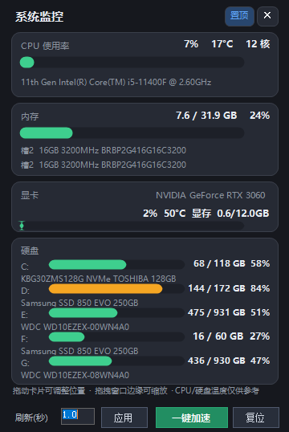

# 系统监控 SysMonitor

轻量级 Windows 系统硬件监控工具 —— 实时查看 CPU / 内存 / 硬盘 / 显卡运行状态，支持一键加速释放内存，界面小巧不占资源。



## 功能特性

- **四卡实时监控**：CPU 使用率与温度、内存占用、硬盘容量（多盘逐一显示）、显卡负载/温度/显存
- **硬件型号识别**：CPU 型号、每根内存条的容量/频率/品牌、每块硬盘的型号、显卡型号
- **一键加速**：一键释放空闲物理内存 + 清理临时文件，腾出资源给其它软件
- **可自由调整**：卡片可拖动排序、刷新间隔可改（0.5–60 秒）、窗口大小可鼠标缩放、可置顶
- **极致轻量**：常驻内存约 30–40 MB，深色界面全自绘

## 下载

请到 [Releases](../../releases) 页面下载最新版 `系统监控.exe`（单文件，免安装，绿色运行）。

> 若系统提示需要 .NET Framework 3.5：控制面板 → 程序 → 启用或关闭 Windows 功能 → 勾选「.NET Framework 3.5（包括 .NET 2.0 和 3.0）」。
> 已实测兼容 Windows 7 SP1 / 8 / 10 / 11。

## 使用说明

- **置顶按钮**（标题栏）：窗口是否保持最前
- **拖动卡片**：按住卡片上下拖动可调整四卡顺序，顺序自动保存
- **缩放**：拖动窗口边缘即可调整大小
- **刷新(秒)**：修改后点「应用」生效，设置自动保存
- **一键加速**：释放内存并清理临时文件，结果在底部显示 10 秒

## 从源码编译

需要 Windows 自带 .NET Framework 编译器（无需 Visual Studio）：

```
build.bat
```

生成的 `SysMonitor.exe` 位于同目录。目标框架 .NET 3.5，兼容 Win7 SP1 及以上（含 32/64 位）。

## 技术说明

- 语言 / 框架：C# / WinForms（.NET 3.5，全自绘、无第三方依赖）
- 数据来源：内核 API（GetSystemTimes / GlobalMemoryStatusEx）、WMI（硬件型号）、nvidia-smi（NVIDIA 显卡负载）
- 不依赖 Windows 性能计数器服务，在精简/优化过的系统上也能正常读取数据

## 支持作者

如果这个小工具对你有帮助，欢迎打赏支持（微信/支付宝收款码，或将截图保存为 `qrcode.png` 放到仓库根目录即可显示）：

```
（此处放置你的收款码图片，如 qrcode.png）
```

也欢迎[提 Issue](../../issues)反馈问题或建议新功能。

## 许可证

见 [LICENSE](LICENSE)。

> 免责声明：CPU/硬盘温度等数据仅供参考，不同主板与驱动的支持情况不同。
